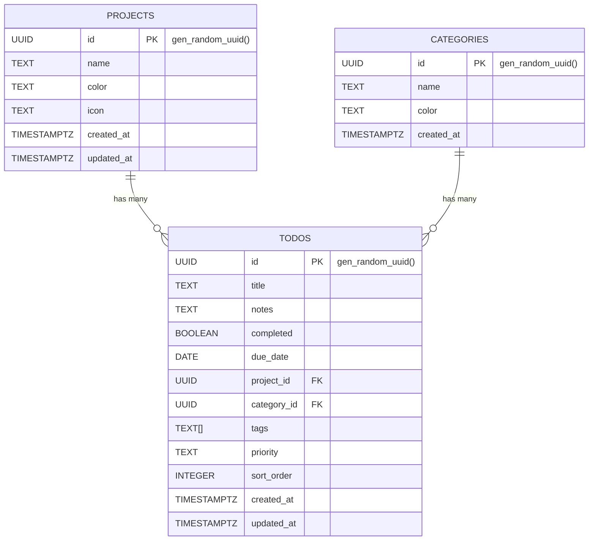

# UpNext — Task Manager

A clean, synced todo app that runs on Mac and iPhone. Built with React + Supabase. Stay organized across all your devices with real-time synchronization, projects, categories, and priority levels.

## 🎯 Overview

UpNext is a **personal task management application** designed for productivity enthusiasts who want a lightweight, fast, and synced todo list across their devices. It combines the simplicity of a todo app with powerful organizational features like projects, categories, tags, and drag-and-drop reordering.

## Features

- ✅ **Multiple Views** — Today / Week / Month / All tasks
- 📁 **Projects** — Organize tasks into projects
- 🏷️ **Categories & Tags** — Categorize and tag your tasks
- 🎯 **Priority Levels** — Set priorities (High / Medium / Low)
- 🖱️ **Drag & Drop** — Reorder tasks with ease
- 🔄 **Real-time Sync** — Automatic sync between Mac and iPhone via Supabase
- 📱 **Progressive Web App** — Install on iPhone home screen via Safari
- 🌍 **Cloud-based** — All data stored in Supabase, accessible anywhere

---

## Database Schema

The following diagram shows the core tables, primary keys (PK), foreign keys (FK), and cardinality. The SQL schema lives in `SUPABASE_SCHEMA.sql`.



Notes:
- `todos.project_id` and `todos.category_id` reference `projects(id)` and `categories(id)` respectively. In the SQL they are created with `ON DELETE SET NULL`, so deleting a project/category will not delete todos — it will null the foreign key.
- `tags` is stored as a `TEXT[]` in Postgres; consider a join table for many-to-many tagging if you need tag metadata or fast tag queries.
- Indexes (e.g., on `due_date`, `project_id`, `completed`, `sort_order`) are defined in `SUPABASE_SCHEMA.sql` for query performance.


---

## Setup (15 minutes)

### Step 1 — Create a Supabase project
1. Go to [supabase.com](https://supabase.com) and create a free account
2. Click **New Project**, give it a name, set a password, choose a region
3. Wait ~2 minutes for it to provision

### Step 2 — Run the schema
1. In your Supabase dashboard, go to **SQL Editor**
2. Open the file `SUPABASE_SCHEMA.sql` from this folder
3. Paste the entire contents into the SQL editor
4. Click **Run** — this creates the tables and seeds default data

### Step 3 — Get your API keys
1. Go to **Settings → API** in your Supabase dashboard
2. Copy the **Project URL** (looks like `https://xxx.supabase.co`)
3. Copy the **anon / public** key

### Step 4 — Set up environment variables
Create a `.env` file in the root of this folder:

```
REACT_APP_SUPABASE_URL=https://your-project.supabase.co
REACT_APP_SUPABASE_ANON_KEY=your-anon-key-here
```

### Step 5 — Run locally
```bash
npm install
npm start
```

Opens at http://localhost:3000

---

## Deploy for free (so it syncs everywhere)

### Option A — Vercel (Recommended)
1. Push this folder to a GitHub repo
2. Go to [vercel.com](https://vercel.com) → New Project → Import your repo
3. Add your environment variables in the Vercel dashboard
4. Deploy — you'll get a URL like `https://upnext-yourname.vercel.app`

### Option B — Netlify
1. Push to GitHub
2. Go to [netlify.com](https://netlify.com) → Add new site → GitHub
3. Add environment variables in Site Settings → Environment Variables
4. Deploy

---

## iPhone Setup (PWA)
1. Open your deployed URL in **Safari** on your iPhone
2. Tap the **Share** button (square with arrow)
3. Tap **Add to Home Screen**
4. Tap **Add** — it now appears as an app icon!

It will sync in real-time with your Mac.

---

## Mac App (Optional)
You can also use the web app in a dedicated window using:
- **Fluid App** (free) — wraps any website into a Mac app
- Or just keep it as a pinned tab in Safari/Chrome

---

## Customizing

### Add a new project
Currently done via Supabase Table Editor (Projects table). A full UI for this is a great next feature to add.

### Add categories
Same — via Supabase Table Editor → categories table.

### Environment variables
| Variable | Description |
|---|---|
| `REACT_APP_SUPABASE_URL` | Your Supabase project URL |
| `REACT_APP_SUPABASE_ANON_KEY` | Your Supabase anon/public key |

---

## Tech Stack
- **React 18** — UI
- **@dnd-kit** — Drag and drop
- **Supabase** — Database + real-time sync
- **date-fns** — Date utilities
- **lucide-react** — Icons
- **Syne + DM Mono** — Fonts
