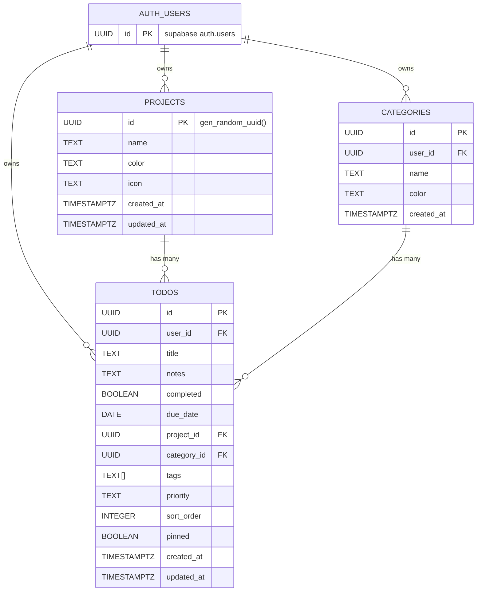

# UpNext — Task Manager

A clean, synced todo app that runs on Mac and iPhone. Built with React + Supabase. Stay organized across all your devices with real-time synchronization, projects, categories, and priority levels.

## 🎯 Overview

UpNext is a **personal task management application** designed for productivity enthusiasts who want a lightweight, fast, and synced todo list across their devices. It combines the simplicity of a todo app with powerful organizational features like projects, categories, tags, and drag-and-drop reordering.

## Features

- ✅ **Multiple Views** — Today / Week / Month / All tasks
- 📁 **Projects** — Organize tasks into projects
- 🏷️ **Categories & Tags** — Categorize and tag your tasks
- 🎯 **Priority Levels** — Set priorities (High / Medium / Low)
- 🖱️ **Drag & Drop** — Reorder tasks with ease
- 🔄 **Real-time Sync** — Automatic sync between Mac and iPhone via Supabase
- 📱 **Progressive Web App** — Install on iPhone home screen via Safari
- 🌍 **Cloud-based** — All data stored in Supabase, accessible anywhere

---

## Database schema

The following diagram shows the core tables, primary keys (PK), foreign keys (FK), and cardinality. The SQL schema lives in `SUPABASE_SCHEMA.sql`.



Table summaries (from `SUPABASE_SCHEMA.sql`):

- Projects
  - id: UUID PK, default gen_random_uuid()
  - user_id: UUID NOT NULL → references auth.users(id) ON DELETE CASCADE
  - name: TEXT NOT NULL (1..100 chars)
  - color: TEXT NOT NULL default '#6366f1' (hex color check)
  - icon: TEXT default '📁' (<= 10 chars)
  - created_at: TIMESTAMPTZ default NOW()
  - updated_at: TIMESTAMPTZ default NOW()

- Categories
  - id: UUID PK, default gen_random_uuid()
  - user_id: UUID NOT NULL → references auth.users(id) ON DELETE CASCADE
  - name: TEXT NOT NULL (1..50 chars)
  - color: TEXT NOT NULL default '#6366f1' (hex color check)
  - created_at: TIMESTAMPTZ default NOW()

- Todos
  - id: UUID PK, default gen_random_uuid()
  - user_id: UUID NOT NULL → references auth.users(id) ON DELETE CASCADE
  - title: TEXT NOT NULL (1..500 chars)
  - notes: TEXT (nullable, <= 5000 chars)
  - completed: BOOLEAN default FALSE
  - due_date: DATE (nullable)
  - project_id: UUID nullable → references projects(id) ON DELETE SET NULL
  - category_id: UUID nullable → references categories(id) ON DELETE SET NULL
  - tags: TEXT[] default '{}'
  - priority: TEXT default 'medium' CHECK IN ('low','medium','high')
  - sort_order: INTEGER default 0
  - pinned: BOOLEAN default FALSE (added via ALTER TABLE)
  - created_at: TIMESTAMPTZ default NOW()
  - updated_at: TIMESTAMPTZ default NOW()

Other DB-level items included in `SUPABASE_SCHEMA.sql`:

- Indexes: todos(user_id), todos(due_date), todos(project_id), todos(completed), projects(user_id), categories(user_id)
- Triggers: `update_updated_at()` and triggers applied to `todos` and `projects` to auto-update `updated_at` on UPDATE
- Row Level Security (RLS) enabled for `todos`, `projects`, `categories` and owner-only policies using `auth.uid()`
- Realtime publication lines for `todos`, `projects`, `categories` (Supabase-specific)

What is missing / recommendations
- categories.updated_at: there is no `updated_at` column or trigger for `categories`. Add `updated_at TIMESTAMPTZ` and include it in the trigger if you want to track edits.
- Seeds: `SUPABASE_SCHEMA.sql` creates structure but does not insert seed data. README previously said it seeds default data; it does not.
- Tags: `tags` is a TEXT[] (simple). If you need tag metadata, counts, or performant tag queries, create a normalized `tags` table and a `todo_tags` join table (many-to-many).
- Uniqueness constraints: consider making `projects(user_id, name)` and `categories(user_id, name)` unique to avoid duplicate-named projects/categories per user.
- Indexes: consider indexing `todos(user_id, completed, due_date)` composite indexes for common queries, and a `GIN` index on `tags` if you keep the array type.
- Soft deletes: if you need to preserve removed rows, add a `deleted_at TIMESTAMPTZ` instead of hard deletes (RLS and policies may need updating).
- Full-text search: add a tsvector column and index if you want fast searching across titles/notes.
- Categories icon: categories currently have no `icon` column — if you want icons like projects have, add it.

If you'd like, I can:
- add `updated_at` to `categories` and apply the `update_updated_at` trigger there
- propose SQL to normalize `tags` to a `tags` + `todo_tags` join table
- add suggested indexes and uniqueness constraints


---

## Setup (15 minutes)

### Step 1 — Create a Supabase project
1. Go to [supabase.com](https://supabase.com) and create a free account
2. Click **New Project**, give it a name, set a password, choose a region
3. Wait ~2 minutes for it to provision

### Step 2 — Run the schema
1. In your Supabase dashboard, go to **SQL Editor**
2. Open the file `SUPABASE_SCHEMA.sql` from this folder
3. Paste the entire contents into the SQL editor
4. Click **Run** — this creates the tables (no seed data included)

### Step 3 — Get your API keys
1. Go to **Settings → API** in your Supabase dashboard
2. Copy the **Project URL** (looks like `https://xxx.supabase.co`)
3. Copy the **anon / public** key

### Step 4 — Set up environment variables
Create a `.env` file in the root of this folder:

```
REACT_APP_SUPABASE_URL=https://your-project.supabase.co
REACT_APP_SUPABASE_ANON_KEY=your-anon-key-here
```

### Step 5 — Run locally
```bash
npm install
npm start
```

Opens at http://localhost:3000

---

## Deploy for free (so it syncs everywhere)

### Option A — Vercel (Recommended)
1. Push this folder to a GitHub repo
2. Go to [vercel.com](https://vercel.com) → New Project → Import your repo
3. Add your environment variables in the Vercel dashboard
4. Deploy — you'll get a URL like `https://upnext-yourname.vercel.app`

### Option B — Netlify
1. Push to GitHub
2. Go to [netlify.com](https://netlify.com) → Add new site → GitHub
3. Add environment variables in Site Settings → Environment Variables
4. Deploy

---

## iPhone Setup (PWA)
1. Open your deployed URL in **Safari** on your iPhone
2. Tap the **Share** button (square with arrow)
3. Tap **Add to Home Screen**
4. Tap **Add** — it now appears as an app icon!

It will sync in real-time with your Mac.

---

## Mac App (Optional)
You can also use the web app in a dedicated window using:
- **Fluid App** (free) — wraps any website into a Mac app
- Or just keep it as a pinned tab in Safari/Chrome

---

## Customizing

### Add a new project
Currently done via Supabase Table Editor (Projects table). A full UI for this is a great next feature to add.

### Add categories
Same — via Supabase Table Editor → categories table.

### Environment variables
| Variable | Description |
|---|---|
| `REACT_APP_SUPABASE_URL` | Your Supabase project URL |
| `REACT_APP_SUPABASE_ANON_KEY` | Your Supabase anon/public key |

---

## Tech Stack
- **React 18** — UI
- **@dnd-kit** — Drag and drop
- **Supabase** — Database + real-time sync
- **date-fns** — Date utilities
- **lucide-react** — Icons
- **Syne + DM Mono** — Fonts
