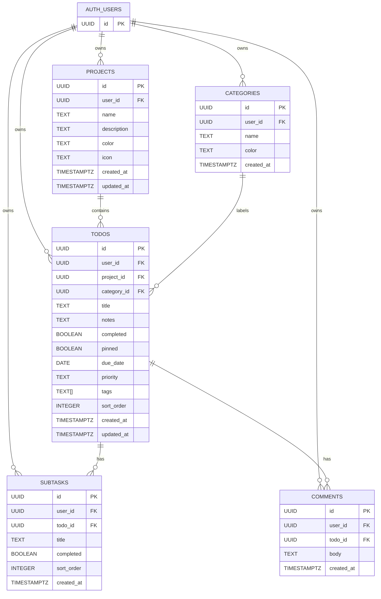

# UpNext — Task Manager

A clean, synced todo app that runs on Mac and iPhone. Built with React + Supabase.

## Features

- ✅ **Multiple Views** — Today / Week / Month / All Tasks
- 📁 **Projects** — Organize tasks into projects with icon, color, and description
- 🏷️ **Categories & Tags** — Categorize and tag tasks; filter by either from the sidebar
- 🎯 **Priority Levels** — High / Medium / Low with visual indicators
- 📌 **Pinned Tasks** — Pin any task to always appear in Today regardless of due date
- 🖱️ **Drag & Drop** — Reorder tasks within any group
- ✅ **Subtasks** — Add subtasks to any task with a progress bar
- 💬 **Comments / Updates** — Log progress notes on any task with timestamps
- 📤 **Export CSV** — Download all tasks as a CSV file
- 📥 **Import CSV** — Bulk import tasks from a CSV file
- 🔄 **Real-time Sync** — Instant sync between Mac and iPhone via Supabase
- 📱 **PWA** — Installs on iPhone home screen via Safari "Add to Home Screen"
- 🔐 **Secure** — Email OTP login, Row Level Security on all tables

---

## Database Schema



### SQL to run in Supabase

All tables and policies are in `SUPABASE_SCHEMA.sql`. Run it once in Supabase SQL Editor. Then run these additional migrations if upgrading from an earlier version:

```sql
-- Pinned column (if not already added)
ALTER TABLE todos ADD COLUMN IF NOT EXISTS pinned BOOLEAN DEFAULT FALSE;

-- Project description
ALTER TABLE projects ADD COLUMN IF NOT EXISTS description TEXT
  CHECK (description IS NULL OR char_length(description) <= 500);

-- Subtasks table
CREATE TABLE IF NOT EXISTS subtasks (
  id         UUID        DEFAULT gen_random_uuid() PRIMARY KEY,
  user_id    UUID        NOT NULL REFERENCES auth.users(id) ON DELETE CASCADE,
  todo_id    UUID        NOT NULL REFERENCES todos(id) ON DELETE CASCADE,
  title      TEXT        NOT NULL CHECK (char_length(title) BETWEEN 1 AND 200),
  completed  BOOLEAN     DEFAULT FALSE,
  sort_order INTEGER     DEFAULT 0,
  created_at TIMESTAMPTZ DEFAULT NOW()
);

-- Comments table
CREATE TABLE IF NOT EXISTS comments (
  id         UUID        DEFAULT gen_random_uuid() PRIMARY KEY,
  user_id    UUID        NOT NULL REFERENCES auth.users(id) ON DELETE CASCADE,
  todo_id    UUID        NOT NULL REFERENCES todos(id) ON DELETE CASCADE,
  body       TEXT        NOT NULL CHECK (char_length(body) BETWEEN 1 AND 2000),
  created_at TIMESTAMPTZ DEFAULT NOW()
);

-- RLS for new tables
ALTER TABLE subtasks ENABLE ROW LEVEL SECURITY;
ALTER TABLE comments  ENABLE ROW LEVEL SECURITY;
CREATE POLICY "subtasks: owner" ON subtasks USING (auth.uid() = user_id) WITH CHECK (auth.uid() = user_id);
CREATE POLICY "comments: owner" ON comments  USING (auth.uid() = user_id) WITH CHECK (auth.uid() = user_id);
```

---

## Setup (15 minutes)

### Step 1 — Create a Supabase project
1. Go to [supabase.com](https://supabase.com) → create a free account
2. Click **New Project**, name it, set a password, choose a region
3. Wait ~2 minutes to provision

### Step 2 — Run the schema
1. Go to **SQL Editor** in your Supabase dashboard
2. Paste and run `SUPABASE_SCHEMA.sql`
3. Then paste and run the migration SQL above

### Step 3 — Get your API keys
1. Go to **Settings → API**
2. Copy the **Project URL** (`https://xxx.supabase.co`)
3. Copy the **anon / public** key

### Step 4 — Configure Authentication
1. Go to **Authentication → URL Configuration**
2. Set **Site URL** to your production domain (e.g. `https://upnext-you.vercel.app`)
3. Add the same URL to **Redirect URLs**
4. Go to **Authentication → Email Templates → Magic Link**
5. Replace the body with:
```html
<p>Your UpNext sign-in code:</p>
<h2>{{ .Token }}</h2>
<p>Expires in 10 minutes.</p>
```

### Step 5 — Environment variables
Create `.env` in the project root:
```
REACT_APP_SUPABASE_URL=https://your-project.supabase.co
REACT_APP_SUPABASE_ANON_KEY=your-anon-key-here
```

### Step 6 — Run locally
```bash
npm install
npm start
# Opens at http://localhost:3000
```

Or with Docker:
```bash
cp .env.example .env   # fill in your keys
docker compose up
```

---

## Deploy (free)

### Vercel (Recommended)
1. Push to a GitHub repo
2. Go to [vercel.com](https://vercel.com) → New Project → import repo
3. Add your two env vars in the Vercel dashboard
4. Deploy → get a URL like `https://upnext-you.vercel.app`

Every `git push` auto-deploys. Roll back any deploy in one click from the dashboard.

---

## iPhone (PWA)
1. Open your Vercel URL in **Safari** on iPhone
2. Tap **Share → Add to Home Screen**
3. Tap **Add**

The app installs as a standalone icon, syncs in real-time with your Mac, and stays logged in automatically.

**Sign in flow:** Enter your email → get a code → paste the code in the app. No redirect links, works perfectly inside the PWA.

---

## Using the App

### Views
| View | Shows |
|---|---|
| Today | Tasks due today + pinned tasks |
| This Week | Tasks grouped by day for the next 7 days |
| This Month | Tasks due this month |
| All Tasks | Everything grouped by project |

### Pinning tasks
Click the 📌 pin icon on any task to make it always appear in Today, even without a due date. Useful for recurring reminders or things you want in sight every day.

### Subtasks
Open any task → click the **Subtasks** tab. Add subtasks with Enter. A progress bar tracks completion. Subtasks are shown on the task card as a thin green bar.

### Comments / Updates
Open any task → click the **Updates** tab. Log progress notes with timestamps. Good for tracking what you've done on a long-running task.

### Projects
Click ⚙ next to **Projects** in the sidebar to add/delete projects. Each project has a name, optional description, emoji icon, and color. Tasks in a project show a colored badge.

### Categories
Click ⚙ next to **Categories** to manage them. Click any category in the sidebar to filter the current view by it.

### Export / Import
- **↓ Export** — Downloads all your tasks as a CSV
- **↑ Import** — Upload a CSV with a `title` column (and optionally `notes`, `priority`, `due_date`, `tags`, `completed`, `pinned`)

---

## Tech Stack
| Layer | Tool |
|---|---|
| UI | React 18 |
| Drag & Drop | @dnd-kit |
| Database & Auth | Supabase (Postgres + RLS) |
| Real-time | Supabase Realtime |
| Dates | date-fns |
| Icons | lucide-react |
| Fonts | Syne + DM Mono |
| Hosting | Vercel |
| Mobile | PWA (no App Store needed) |

---

## Security
- **Email OTP** — No passwords. Sign in via a code sent to your email
- **Row Level Security** — Every table enforces `auth.uid() = user_id` at the database level. The anon key is safe to expose in the browser
- **Input validation** — All fields sanitized and length-limited client-side and via DB constraints
- **No service key in frontend** — Only the anon key is used; the service role key is never included
